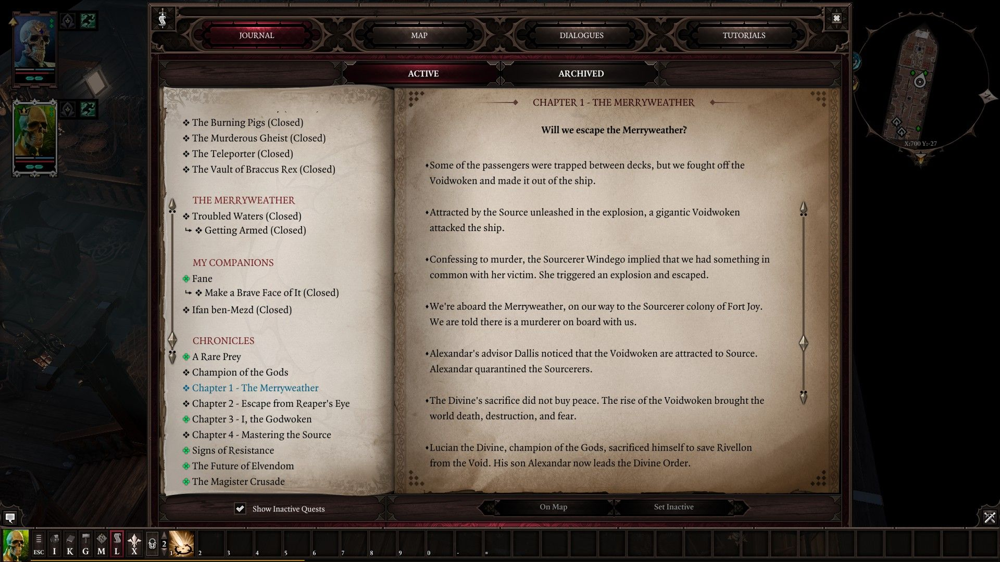
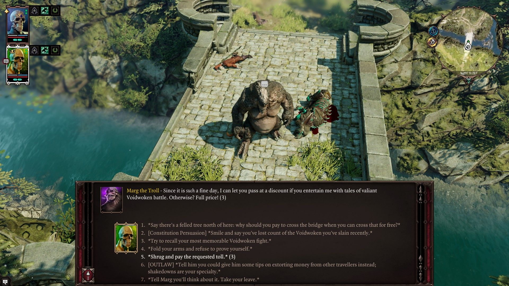
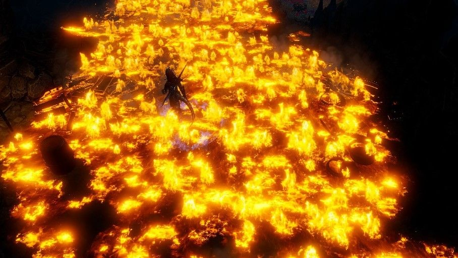
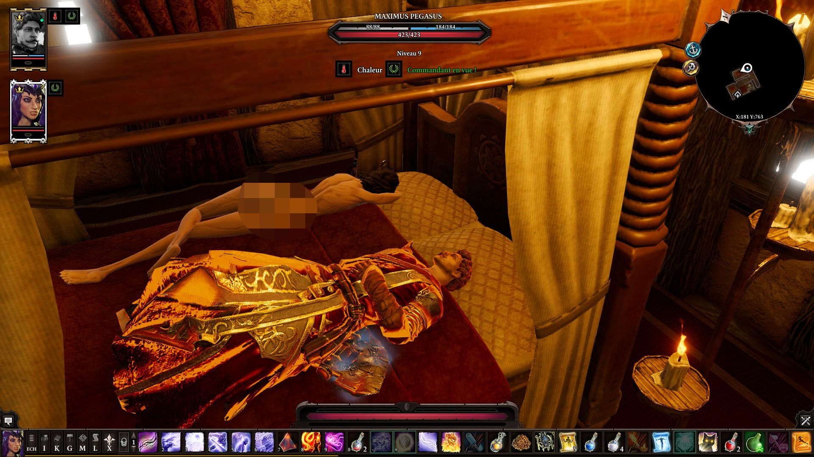
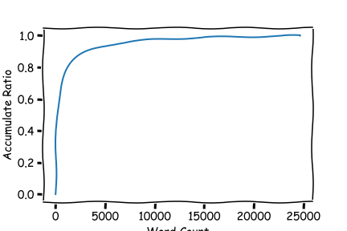

## 简介

神界原罪2(Divinity Orginal Sin 2) 是由Larian工作室出品的一款用于学习GRE单词的模拟答题软件(认真)。

其借助庞大的阅读题库

沉浸式的答题方式

噩梦级的答错惩罚

以及18R级的答对奖励

而闻名于世。

因此有人说这个应该叫神界雅思2，有人说应该叫专八原罪2。

**那么，到底需要多少单词量才能在这个软件中掌握雷电呢？**

## 结论

勉强玩 需要掌握的词汇量：~ 1260
勉强玩懂 需要掌握的词汇量：~ 4223
轻松玩懂 需要掌握的词汇量: ~ 15973
彻底玩懂 需要掌握的词汇量：~ 24678

## 讨论

通过解包分析（见下一节详情），游戏的文本文档大小为12.8 MB，包含91988句对话，总计约1112347词。初略估计，其中包含的不重复词汇，即用词量达到了24678词。

其中，与大多数日常英文文本结构不同的時，由于神界原罪2**故意**使用大量高级词汇，使得词汇分布较为平均。即除少数常用词外，绝大多数词汇在这一百万文本中仅出现一次或者两次。从词频统计来看，游戏有9548词在游戏中出现且仅出现过一次。有14591词出现不超过3次。

因此，如果想要彻彻底底搞清楚这款游戏的全部内容，需要由两万余字的词汇量。不过，这24678词并非完全确切的字数。

其一，本文实用的方法中忽略了如游戏内**CG语音字幕**，不过由于我印象中CG的用词较为简单，应全部或大部分被包含在游戏对话中。

其二，对单词的定义也一直没有所谓定论。比方说一个词的**单复变化**（已排除）、**形态变化**（已排除）、**形容动名变化**等形式的出现，使得大部分情况下，你知道一个词的意义，可以简单而自然的推出其他多个形式的意义。那么应该算作一个词还是多词是不易决定的。当然，简单的情况下，诸如从word到words的变化可以简单的考虑为一个词，但较为混淆的情况，诸如datum到data的演变，初学者可能难以察觉到其为同一词。即便初学者身负慧根，那么如flection,deflection，jolly,jocular等变化恐怕难以察觉。因此，本文采用简单的方法处理，即排除了单复名词、時态变化这两种变化，而保留了其他的变化形式。因此这24678词针对于普通的学习者而非举一反三的词根词缀专家。

其三，英语并非由固定单词组成。游戏与日常生活中大量**合成词**的出现使得实际词汇更多。合成词属于新单词么这个问题，在文章中的定位为新单词。毕竟简单的如home-made还容易一眼识别，困难的合成词如lenovo意义就已经发生了改变。而神界原罪中的合成词并非少数，因此实际理解上来看，需要的词汇是被高估了的。同時**拟声词**更彻底颠覆了单词的固定形式，如模仿羊叫的：mbaaaaaaaaaaaa, baaaaaaa等，这类词的变化太多，人家不同🐏羊的叫声却又区别，比如有的羊mbaa,有的羊mbaaaaaaaaaaaaaaaaaaaaaaaaaaaaaaaaaaaaaaaaa……但其本身确实传递了意义，并不能将其排除于文本之外。因此统计時考虑了这类拟声词。不过不用担心，虽然游戏内拟声词很多，但占不到其庞大文本量的万一。

其四，个人认为介词并不能传递任何信息，将英语中的介词全部删掉不影响任何表达，因此统计時，人为的将'the', 'a', 'is', 'and', 'of', 'to', 'are', 'were', 'am', 'be', 'in', 'with', 'so', 'then', 'that', 'at', 'an'等词排除到比例考察之外。望知悉。

最后，本文给出了各类人需要的词汇量。这仅是单纯尝试的从理性文字工作者到感性文字工作者的的转变。比方说，勉强玩的意思我自己都不知道指代什么。勉强玩懂又是啥意思。二者区别是什么，轻松玩又是多轻松。总而言之，言而总之。其对应的比例分别为：80.0%, 92.5%, 99.0%, 100%. 读者可根据自己想要到达的比值去准备词汇量。

## 附录

词汇量占比图

词频统计表，第一列为词频数，第二列为累计占比
count 24789.000000 24789.000000
mean 44.880552 0.952236
std 638.827245 0.085320
min 1.000000 0.000000
25% 1.000000 0.951000
50% 2.000000 0.982805
75% 8.000000 0.992971
max 53738.000000 1.000000

  
数据的处理过程

    
    1. 游戏语言文件解包 PAK -> xml
    2. 提取文件文本 xml -> txt
    3. 清洗文本并简单处理 txt -> list
    4. 分析总结
   

## 单词本

鉴于需求，提供6频以上单词本txt文件的下载与导入。

**点击下载** https://github.com/imhlq/DOS2-Vocabulary/raw/master/vocabulary/words6.txt

## 参考资料

1. http://forums.larian.com/ubbthreads.php?ubb=showflat&Number=644650&page=1
2. http://www.nltk.org/api/nltk.stem.html?highlight=lemmatizer
3. https://www.lingholic.com/how-many-words-do-i-need-to-know/
4. https://forum.ghost.org/t/add-discussion-of-collapsible-expandable-text-to-markdown-article/3498
