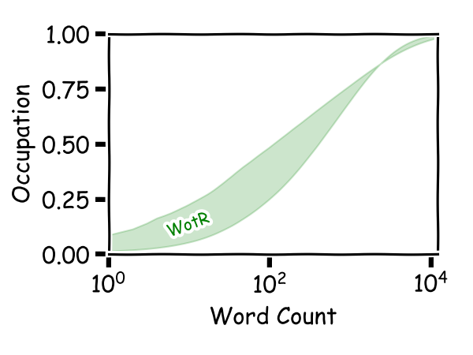

## 前言

这是系列文章，旨在探索**第九艺术**（主要是文本量较大的RPG）的用词结构。作为茶余饭后，探索游戏另一个纬度的尝试。有兴趣可阅读之前的文章：

- [究竟需要掌握多少单词才能玩懂神界原罪2](https://xhou.me/2020/06/%E7%A9%B6%E7%AB%9F%E9%9C%80%E8%A6%81%E6%8E%8C%E6%8F%A1%E5%A4%9A%E5%B0%91%E5%8D%95%E8%AF%8D%E6%89%8D%E8%83%BD%E7%8E%A9%E6%87%82%E7%A5%9E%E7%95%8C%E5%8E%9F%E7%BD%AA2/)
- [究竟需要掌握多少单词才能玩懂博得之门3](https://xhou.me/2020/10/%E9%9C%80%E8%A6%81%E5%A4%9A%E5%B0%91%E5%8D%95%E8%AF%8D%E5%8F%AF%E4%BB%A5%E7%8E%A9%E6%87%82%E5%8D%9A%E5%BE%B7%E4%B9%8B%E9%97%A83/)
- [究竟需要掌握多少单词才能玩懂正义之怒](https://xhou.me/2022/11/究竟需要掌握多少单词才能玩懂正义之怒/)

这里谈的是**上古卷轴5天际**，英文为**The elder scrolls 5: Skyrim**.

## 正文

下面我们正式开始正义之怒的文字量分析：

游戏本体+DLC大小在32G左右，英文JSON文本大小为19.5MB. 含2243107词，过滤停止词后为1191595词。其中词汇量为31502，除去停止词与词形变化后为18126。除停止词外，出现频率最高的为one(8190次)，其次为demon(6569次)——游戏的主题不言而喻。

下图是词汇的覆盖率随词汇量变化的曲线，其中下曲线代表原文本单词，上曲线表示除去停止词与词形变化后的单词。

即**946**单词可以覆盖68.2%的内容（除去停止词），排序在这里的词为ahead；
**5044**单词可以覆盖95.4%的内容，这里的单词是 bout;
**14909**单词可以覆盖99.7%的内容，到这的单词为 sanctorum;

> 关于文本的处理方法也在不断优化，稍后会写一篇文章，详细讲解语言处理的途径，以免造成误解。
