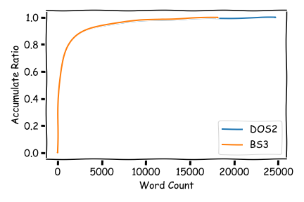

## 前言

几个月前，写过一篇介绍神界原罪2的文章，简述了神界原罪2所需要的单词量。

前文：[究竟需要掌握多少单词才能玩懂神界原罪2](https://xhou.me/blog/dos2words/)

如今，拉瑞安工作室发布了博德之门3的EA早期测试版本，并在销售当日疑似挤爆steam的付款系统，并成功冲入steam游戏在线人数的前十名。这个对于一个在EA阶段，内容只解锁第一章的游戏来说，该要载入steam的游戏史册了。

其中一个重要的方面源自于神界原罪2的成功。正如有网游说的，神界原罪2满足了他童年时对于游戏的全部幻想。如今，博德之门3发布，引擎用的依旧是神界2引擎的改进版，主笔依然是Sarah Baylus，甚至剧情都是1.开始在一艘船上 2.船被怪兽袭击 3.主角在沙滩醒来 的三段式经典开局方式。

因此，博德之门3秉承着拉瑞安的一贯风格，想来在单词量上不会有太多“变化”。

这里需说明的是，无论是之前神界系列抑或博德之门系列。虽然单词量庞大，但这绝不是作者故意的使用不食人间烟火的古英语词汇，抑或连老外都没见过的异类。而是单纯由于Sarah娴熟的笔法，剧本式的精准描述每个事物。其实，两万三万的单词量，大多数英语作为第一语言的大学生都可以达到。不过，像这样大量准确的用词，华丽的描述剧情的文本，不失为英语学习者的完美材料。

## 正文

下面我们正式开始博德之门3的文字量分析：

*注：本文使用的版本均为EA即早期体验版。该版本下游戏大小为83G，内容只解锁第一章。但考虑到，猜测最终版本大小应不超过150G（否则对玩家硬盘占用太大，如GTA/FF15等均未超过）EA版应已包含部分未解锁内容。但鉴于游戏文本包仅4.3Mb，尚小于神界2终极版的文本包5.6Mb大小。因此，其包含的内容应不为全部内容。*

感谢*Norbyte*成功对博得之门3进行解包。得到了博德之门3的原始文本文件。大小约 10.0 Mb.

借助上次的方法简单统计后，（具体请参阅上次拙作[究竟需要掌握多少单词才能玩懂神界原罪2](https://xhou.me/blog/dos2words/)）

我们最终得到如下结果：

**博德之门3文本总计字数为：620561 （神界 1112342）
词汇量大小为：18154 （神界 24678）** 

对比神界2，可以说是相当小了。当然要考虑这只是EA阶段的试玩版。

同样，如果想要大致玩懂（80%）则仅需要**1279**单词；而要轻松玩懂（99.0%）的单词量为：**13104**

有趣的是，当我们试图去画出博得3(BS3)的词汇积累率图时，居然与神界2(DOS2)的惊人的相似。或许，这是英语单词普遍的规律？抑或，这只是拉瑞安习惯的构词方式？留有兴趣的人去研究吧！

## 尾巴

对博德之门3的分析告一段落，待到博德之门3出正式版或者终极版的时候，本文可能会更新。
此致，敬礼。