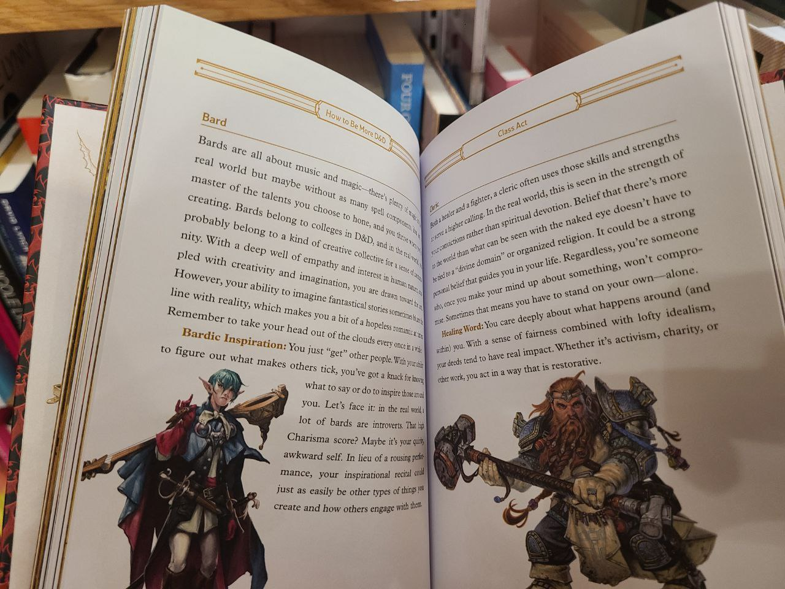
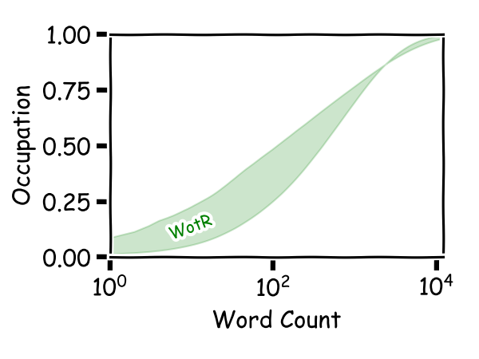

## 前言

这是系列文章，旨在探索**第九艺术**（主要是文本量较大的RPG）的用词结构。作为茶余饭后，探索游戏另一个纬度的尝试。有兴趣可阅读之前的文章：

- [究竟需要掌握多少单词才能玩懂神界原罪2](https://xhou.me/2020/06/%E7%A9%B6%E7%AB%9F%E9%9C%80%E8%A6%81%E6%8E%8C%E6%8F%A1%E5%A4%9A%E5%B0%91%E5%8D%95%E8%AF%8D%E6%89%8D%E8%83%BD%E7%8E%A9%E6%87%82%E7%A5%9E%E7%95%8C%E5%8E%9F%E7%BD%AA2/)
- [究竟需要掌握多少单词才能玩懂博得之门3](https://xhou.me/2020/10/%E9%9C%80%E8%A6%81%E5%A4%9A%E5%B0%91%E5%8D%95%E8%AF%8D%E5%8F%AF%E4%BB%A5%E7%8E%A9%E6%87%82%E5%8D%9A%E5%BE%B7%E4%B9%8B%E9%97%A83/)
- [究竟需要掌握多少单词才能玩懂上古卷轴5](https://xhou.me/2022/11/究竟需要掌握多少单词才能玩懂上古卷轴5/)

这里谈的是**拥王者：正义之怒**，英文为**Pathfinder: Wrath of the Righteous**. 这部作品名气并没有神界原罪2那么高，但在核心CRPG玩家圈子里的地位却不亚于神界原罪2. 关键点在于，这个游戏依旧是传统意义上的CRPG，也即基于DND规则下Pathfinder规则的电子化。虽然较桌上纸笔下的传统规则做了优化，但这个优化并非神界原罪2大刀阔斧的重制，更多的一些面向电脑端的优化与操作的简化。就好比电脑版的斗地主、麻将，并不对原规则进行修改。因此，在我看来，拥王者系列算是老DND的电脑版，神界原罪是电脑RPG爱好者的TRPG版。这点来说，博得之门才算是拥王者同类型作品，当然，拉瑞安工作室的博得之门3更可能吸取的是神界原罪2的成功经验，未必就去走博得之门的老路了。

## 国产游戏

谈到TRPG，突然想到一点，中国的游戏产业不景气有一点很重要的原因——我们起步太晚了。在我看来社会层面的抵制是结果而非原因，就大多国产游戏的质量而言，常人很难不去抵制。而起步晚，不是晚一点两点，不是一年两年，而是三十年，五十年的量级。单看电子游戏，可能国内因为物质、時代原因，没有经历雅达利、黑岛的黄金時代。但事实上，RPG先驱的TRPG作为笔纸上就可以玩的游戏，在西方更早就已出现：DND初版发布于1974年，Tactics发布于1954年，更不用谈兵棋推演（Wargame）更是19世纪初就已在普鲁士诞生。因此西方社会，有四五十年资深游戏经验的玩家一大把。现在中国社会有多少二十年以上游戏经验的玩家呢？因此对国内游戏产业前景倒不必过于悲观，因为客观上的原因终究会被時间自然解决。届時，第九艺术的兴起也不过是早晚的问题。

## 正文

下面我们正式开始正义之怒的文字量分析：

游戏本体+DLC大小在32G左右，英文JSON文本大小为19.5MB. 含2243107词，过滤停止词后为1191595词。其中词汇量为31502，除去停止词与词形变化后为18126。除停止词外，出现频率最高的为one(8190次)，其次为demon(6569次)——游戏的主题不言而喻。

下图是词汇的覆盖率随词汇量变化的曲线，其中下曲线代表原文本单词，上曲线表示除去停止词与词形变化后的单词。

即**946**单词可以覆盖68.2%的内容（除去停止词），排序在这里的词为ahead；
**5044**单词可以覆盖95.4%的内容，这里的单词是 bout;
**14909**单词可以覆盖99.7%的内容，到这的单词为 sanctorum;

> 关于文本的处理方法也在不断优化，稍后会写一篇文章，详细讲解语言处理的途径，以免造成误解。

## 讨论

实际对文字的理解是相当复杂的，大多数人可以在结合语境的情况下，猜到未知词的意思。而这个猜的能力，又往往随着单词量的上升而上升。比方说（数字仅用于举例，并无考证），知道3000词的人，往往多猜1000词，也即覆盖了4000。但知道5000词的人，就能多猜2000词，覆盖了7000词汇。很难说到底多少掌握多少词可以“看懂”游戏文本。一些通常语言研究说，学会3000单词即可覆盖95%的内容(Hazenberg and Hulstijn, 1996)，学会10000单词即可覆盖99%的内容(Nation (1990) and Laufer (1997))。我们这里的数据便非如此。

游戏文本并不一定需要看懂，玩游戏的过程也在学习单词。人类幼年，大量的单词储备都是从与人的游戏中熟悉掌握。而电子游戏更是如此，我玩游戏時看到一个单词如Magic ward，不知道ward是什么意思，但在游戏中随時随地使用以这个单词描述的技能。眼前出现了一个魔法屏障，阻挡所有魔法伤害。瞬间明白原来单词時这个意思，往往比单纯背字典，要了解的更加实际、彻底。因此，这个单词之前会不会，并不影响理解游戏。再如，遇到怪物，怪物头顶写着怪物的名字，如demon，玩家便立刻知道了，从外语学习角度来看，这简直就是看图识字来学习语言的最好方法了。这点也是我写这系列文章的一个初衷，一方面，标题写作多少单词可以玩懂XXX，但另一方面，岂不是玩这个游戏可以学会多少单词么？
